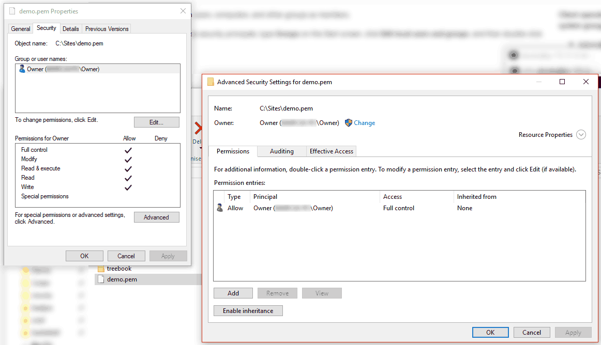

### Setting permissions for pem file

You locate the file in Windows Explorer, right-click on it then select "Properties". Navigate to the "Security" tab and click "Advanced".

Change the owner to you, disable inheritance and delete all permissions. Then grant yourself "Full control" and save the permissions. Now SSH won't complain about file permission too open anymore.

